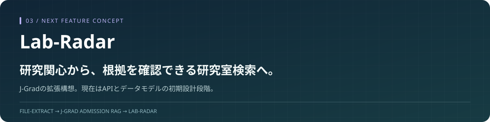

<p align="center"></p>

# Lab-Radar

**研究テーマ・研究手法・学生の関心をもとに、候補研究室とその根拠を提示する機能の構想・設計リポジトリです。**

留学支援では「どう出願するか」に加え、「どの研究室が自分の研究関心に近いか」を調べる必要があります。その需要から生まれた構想で、将来は **[J-Grad-Admission-RAG](https://github.com/yasu-isct/J-Grad-Admission-RAG)** の研究室検索機能として統合する方向を検討しています。

> **現在：構想とAPI・データモデルの初期実装。研究室検索・推薦は未実装です。**
> 現在のmatch APIは空の候補と `retrieval_strategy: "placeholder"` を返します。以下の検索・評価・画面案は今後の設計であり、完成した機能や実績ではありません。

## 解きたい課題

研究室の情報は、大学・教員・研究室のWebページや論文に分散しています。「ロボティクス」のような分野名が同じでも、対象、手法、必要な背景知識が異なります。

教務担当者や学生が候補を比較する際に、名前の一覧だけでなく、**どの資料のどの記述から関連性を見いだしたか**を確認できることを目指します。

## J-Gradとの役割分担

| 利用者が知りたいこと | 担当する機能 |
| --- | --- |
| 出願期間、提出書類、試験情報、準備状況 | J-Gradの既存機能 |
| 関心や研究計画に近い研究室と、その理由 | Lab-Radarで検討する拡張 |
| その研究室に関連する出願情報 | 将来、共通の学校・組織IDで接続する構想 |

共通の対象選択・出典表示・レポートを再利用し、研究室資料の取得・更新・検索評価は専用に設計する方針です。現時点でJ-Gradへの接続は実装していません。

## 目指す利用体験

```text
研究関心・研究計画を入力
  → 分野・対象・手法から候補を検索
  → 研究室ごとの関連点と不一致・未確認点を整理
  → 根拠のWebページや論文を確認
  → 教務担当者・学生が候補を比較
```

たとえば「高齢者支援のための対話ロボット」に関心がある場合、同じロボット分野でも、対人インタラクションを研究する候補と、製造ラインの制御を研究する候補では、比較すべき点が異なります。この区別を説明できる検索を検討します。

**これは機能説明用の例で、実在の教員への推薦結果ではありません。** 研究上の関連性は、受入可否・空き枠・出願資格・合格可能性を意味しません。

## 実装済みと検討中

| 区分 | 内容 |
| --- | --- |
| 実装済み | FastAPI起動、health API、推薦APIの境界、教員・研究計画・推薦結果のPydanticモデル |
| 実装済み | healthと空の推薦レスポンスを確認するテスト、lint/test CI、環境変数テンプレート |
| 未実装 | 実データの収集、埋め込み索引、検索・reranking、根拠付き推薦 |
| 未実装 | 利用者向け画面、J-Gradとの統合、推薦品質の実測 |

現時点の実装技術は **Python 3.11+ / FastAPI / Pydantic / pytest / Ruff / GitHub Actions** です。

Scrapy、Sentence Transformers、Qdrant/ChromaDB、Ragas等の追加依存・候補は定義されていますが、完成したデータパイプラインや採用済みの検索方式を意味しません。モデル・DB・rerankerは小さな比較実験を踏まえて選ぶ予定です。

## 次に検証する設計

1. **小さな対象範囲を決める。** 一つの研究分野で、出典・取得日・所属が分かる研究室資料を用意する。
2. **比較基準を作る。** 研究テーマ、手法、対象の関連性を、教務担当者が確認できる形で定義する。
3. **単純な方法から比較する。** キーワード検索、埋め込み検索、必要ならrerankingの差を確認する。
4. **根拠と保留理由を評価する。** 関連候補が出るだけでなく、説明が出典に支えられているか確認する。
5. **結果を見て統合を判断する。** J-Gradの既存機能を複製せず、共通化する箇所と独立させる箇所を決める。

[設計メモ：入力・出力・評価・統合境界](docs/design-ja.md)

## APIの骨格を確認する

以下は検索デモではなく、初期APIの動作確認です。APIキー・LLM呼出し・実研究室データは不要です。

```powershell
git clone https://github.com/yasu-isct/Lab-Radar.git
cd Lab-Radar
python -m venv .venv
.\.venv\Scripts\python.exe -m pip install -e ".[dev]"
.\.venv\Scripts\python.exe -m uvicorn backend.app.main:app --host 127.0.0.1 --port 8000
```

`http://127.0.0.1:8000/docs` でAPI仕様を確認できます。終了は `Ctrl+C`。

| エンドポイント | 現在の動作 |
| --- | --- |
| `GET /health` | `{"status":"ok"}` |
| `POST /api/v1/recommendations/match` | 入力を検証し、空の `matches` と `placeholder` を返す |

```powershell
.\.venv\Scripts\python.exe -m ruff check .
.\.venv\Scripts\python.exe -m pytest
```

CIは現在の骨格の動作を確認します。検索精度や推薦の有用性を測定したものではありません。

## コードの入口

- [API定義](backend/app/api/routes/recommendations.py)：検索処理を接続する境界。
- [データモデル](backend/app/models/schemas.py)：教員、論文、研究計画、推薦理由の初期契約。
- [現在のservice](backend/app/services/matching.py)：未実装部分を明示したplaceholder。
- [テスト](tests/test_api.py)：現在の実装範囲の確認。

## 公開リポジトリの位置付け

このリポジトリでは、課題設定・初期API設計・今後の検証方針を示します。生成AIのコーディング支援を活用した初期骨格を含みます。J-Gradの塾内向け業務版は非公開で継続開発する方針であり、この構想の統合範囲・時期は今後決めます。

**[file-extract：初期RAGの探索](https://github.com/yasu-isct/file-extract)** → **[J-Grad：教務支援システム](https://github.com/yasu-isct/J-Grad-Admission-RAG)** → **Lab-Radar：研究室検索の拡張構想**
